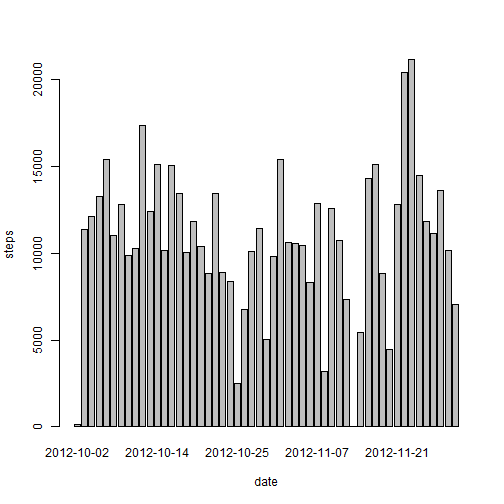
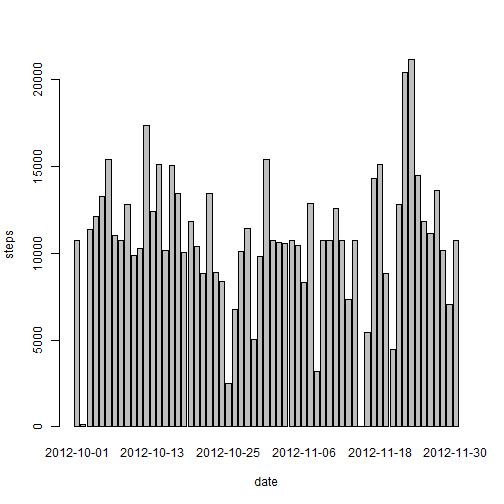

In preparation for the analysis to follow - read the activity data in
## Loading and preprocessing the data

```r
setwd("C:/Reproducible Research/Reproducible Research Peer Assessment 1")
act <- read.csv("C:/Reproducible Research/activity.csv")
```

## What is the mean total number of steps taken per day?

1. Histogram of steps taken each day


```r
stepsbydate <- aggregate(steps ~ date, data=act, FUN=sum)
barplot(stepsbydate$steps, names.arg=stepsbydate$date, xlab="date", ylab="steps")
```



2. Calculate mean, median and tot number of steps taken by day


```r
mean(stepsbydate$steps)
```

```
## [1] 10766.19
```

```r
median(stepsbydate$steps)
```

```
## [1] 10765
```

```r
stepsbydate
```

```
##          date steps
## 1  2012-10-02   126
## 2  2012-10-03 11352
## 3  2012-10-04 12116
## 4  2012-10-05 13294
## 5  2012-10-06 15420
## 6  2012-10-07 11015
## 7  2012-10-09 12811
## 8  2012-10-10  9900
## 9  2012-10-11 10304
## 10 2012-10-12 17382
## 11 2012-10-13 12426
## 12 2012-10-14 15098
## 13 2012-10-15 10139
## 14 2012-10-16 15084
## 15 2012-10-17 13452
## 16 2012-10-18 10056
## 17 2012-10-19 11829
## 18 2012-10-20 10395
## 19 2012-10-21  8821
## 20 2012-10-22 13460
## 21 2012-10-23  8918
## 22 2012-10-24  8355
## 23 2012-10-25  2492
## 24 2012-10-26  6778
## 25 2012-10-27 10119
## 26 2012-10-28 11458
## 27 2012-10-29  5018
## 28 2012-10-30  9819
## 29 2012-10-31 15414
## 30 2012-11-02 10600
## 31 2012-11-03 10571
## 32 2012-11-05 10439
## 33 2012-11-06  8334
## 34 2012-11-07 12883
## 35 2012-11-08  3219
## 36 2012-11-11 12608
## 37 2012-11-12 10765
## 38 2012-11-13  7336
## 39 2012-11-15    41
## 40 2012-11-16  5441
## 41 2012-11-17 14339
## 42 2012-11-18 15110
## 43 2012-11-19  8841
## 44 2012-11-20  4472
## 45 2012-11-21 12787
## 46 2012-11-22 20427
## 47 2012-11-23 21194
## 48 2012-11-24 14478
## 49 2012-11-25 11834
## 50 2012-11-26 11162
## 51 2012-11-27 13646
## 52 2012-11-28 10183
## 53 2012-11-29  7047
```

## What is the average daily activity pattern?

1. Create a time series plot with 5-minute interval on x axis and average number of steaps
taken on the y axis.


```r
stepsbyinterval <- aggregate(steps ~ interval, data=act, FUN=mean)
plot(stepsbyinterval, type="l")
```


2. Which 5-minute interval, on average across all the days in the
dataset, contains the maximum number of steps?


```r
stepsbyinterval$interval[which.max(stepsbyinterval$steps)]
```

```
## [1] 835
```


## Section for Imputing missing values

1. Calculate and report the total number of missing values in the
dataset (i.e. the total number of rows with `NA`s)


```r
sum(is.na(act))
```

```
## [1] 2304
```

2. Devise a strategy for filling in all of the missing values in the
dataset. The strategy does not need to be sophisticated. For
example, you could use the mean/median for that day, or the mean
for that 5-minute interval, etc.

The strategy used will be means for intervals filling in for the missing values.

3. Create a new dataset that is equal to the original dataset but with
the missing data filled in.


```r
act <- merge(act, stepsbyinterval, by="interval", suffixes=c("",".y"))
nas <- is.na(act$steps)
act$steps[nas] <- act$steps.y[nas]
act <- act[,c(1:3)]
```

4. Make a histogram of the total number of steps taken each day and
Calculate and report the **mean** and **median** total number of
steps taken per day. Do these values differ from the estimates from
the first part of the assignment? What is the impact of imputing
missing data on the estimates of the total daily number of steps?


```r
stepsbydate <- aggregate(steps ~ date, data=act, FUN=sum)
barplot(stepsbydate$steps, names.arg=stepsbydate$date, xlab="date", ylab="steps")
```



```r
mean(stepsbydate$steps)
```

```
## [1] 10766.19
```

```r
median(stepsbydate$steps)
```

```
## [1] 10766.19
```

Impact is moderate at best.


## Are there differences in activity patterns between weekdays and weekends?

1. Create a new factor variable in the dataset with two levels --
  "weekday" and "weekend" indicating whether a given date is a
weekday or weekend day.


```r
daytype <- function(date) {
  if (weekdays(as.Date(date)) %in% c("Saturday", "Sunday")) {
    "weekend"
  } else {
    "weekday"
  }
}
act$daytype <- as.factor(sapply(act$date, daytype))
```

2. Make a panel plot containing a time series plot (i.e. `type = "l"`)
of the 5-minute interval (x-axis) and the average number of steps
taken, averaged across all weekday days or weekend days
(y-axis).


```r
par(mfrow=c(2,1))
for (type in c("weekend", "weekday")) {
  steps.type <- aggregate(steps ~ interval,
                          data=act,
                          subset=act$daytype==type,
                          FUN=mean)
  plot(steps.type, type="l", main=type)
}
```


